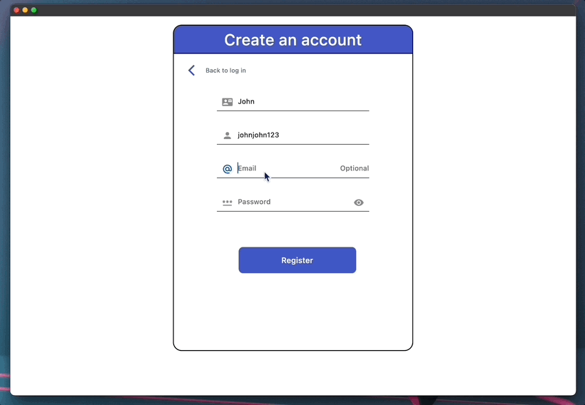
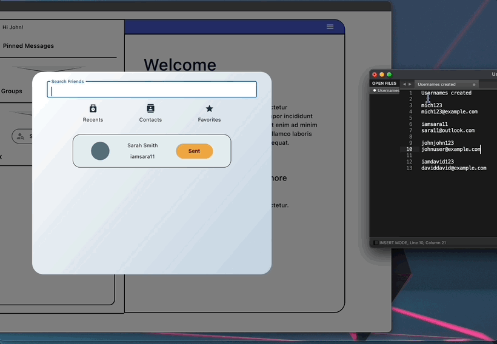
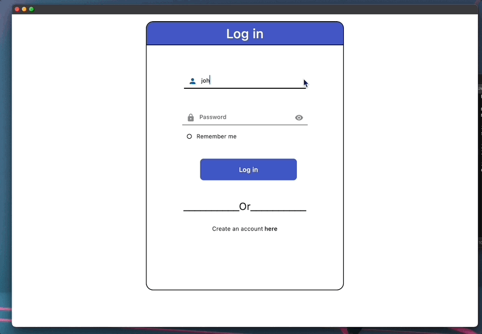
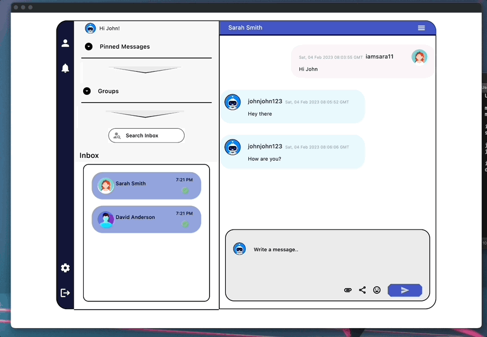

# Flask-Flet Chat Application

## Table of Contents:
- [Introduction](#introduction)
- [Features](#features)
- [Dependencies](#dependencies)
- [Upcoming Features](#upcoming-features)
- [Project Showcase](#project-showcase)

### Introduction

This is a chat application built with Python, utilizing the Flask web framework and Flet library for the frontend user interface. The backend server uses the Flask, JSON, Requests, and Datetime libraries to handle user interactions and data storage.

### Features

With this chat app, you can:
- User authentication and registration
- User account creation
- Account user login
- Search other users by username, email or name.
- Initiate and accept friend requests
- Contact list or friends list
- Delete user accounts
- Monitor your notifications
- Send and receive messages
- Engage in conversation with your added contacts
- Ability to see delivery and read receipts

The app stores all user data in an SQLite database for efficient and secure data management.

### Dependencies

Flet is a frontend framework that provides a modern and efficient way to build user interfaces. It's a relatively new framework, but it already boasts an impressive set of features and capabilities. If you're looking for an amazing frontend framework then Flet is definitely worth checking out: https://flet.dev/.

### Upcoming Features
The Flask-Flet Chat Application is constantly being updated and improved, and new features are being added all the time. Some of the exciting upcoming features include a theme change option, profile customization, system notifications, password change functionality, message search function, ability to create group chats and more. Stay tuned for updates and new releases.\n

Collaborations are always welcome, please contact me or submit your PR.

### Project Showcase

